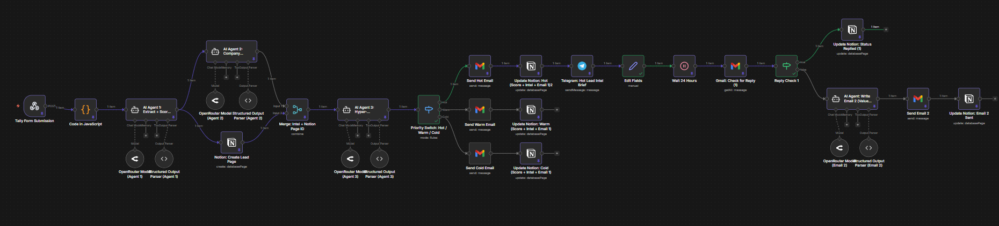
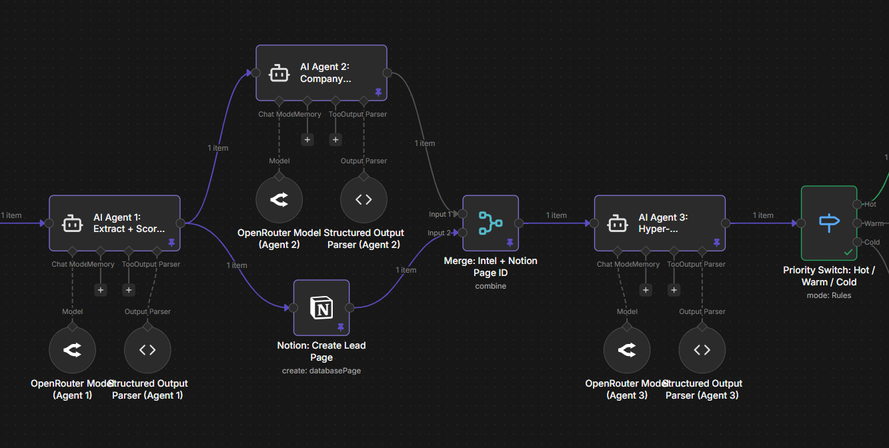
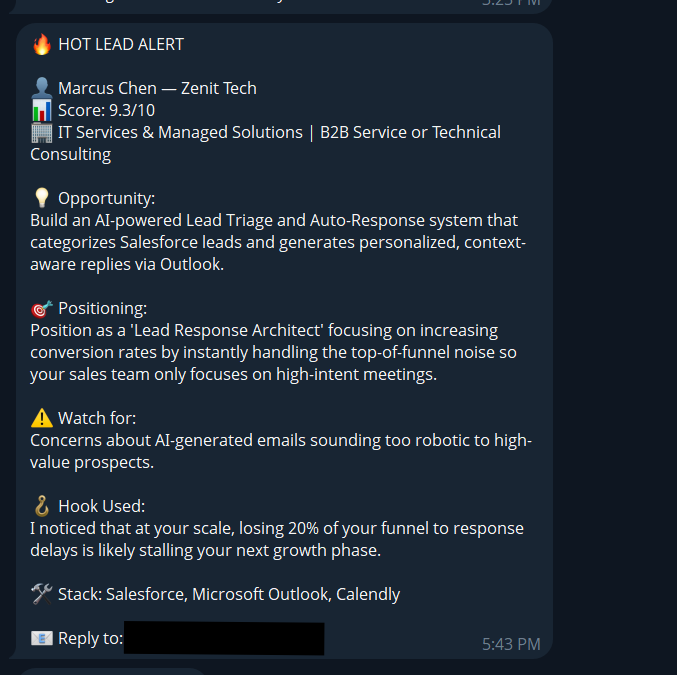

# 🎯 Autonomous Lead Intelligence & Enrichment Pipeline

> Built with n8n · OpenRouter (Gemini) · Gmail API · Notion API · 
Telegram Bot · JavaScript

---

## The Problem

Most businesses collect leads and lose them to slow follow-ups and 
zero qualification logic. Every hot lead treated slowly loses money. 
Every cold lead treated like a hot one wastes time.

---

## What This Does

A fully autonomous multi-agent lead intelligence pipeline that 
activates the moment a Tally form is submitted — enriching, scoring, 
and reaching out without a single human touchpoint.

**Key capabilities:**
- Enriches company and contact data automatically
- Classifies leads as Hot, Warm, or Cold using LLM scoring logic
- Dispatches uniquely personalized outreach emails per classification
- Fires instant Telegram alerts for Hot leads
- Sends AI-written follow-ups after 24 hours of no reply
- Lead response time: under 60 seconds from form submission

---

## Workflow Overview

---

## Logic & Routing Detail

## Sample Output

---

## Tech Stack

| Tool | Role |
|---|---|
| n8n | Workflow orchestration |
| OpenRouter (Gemini) | LLM scoring and email generation |
| Tally | Form trigger / webhook |
| Gmail API | Outreach and follow-up delivery |
| Notion API | Lead logging and CRM |
| Telegram Bot | Hot lead instant alerts |
| JavaScript | Custom logic and data transformation |

---

## How To Use This Workflow

1. Download `lead-enrichment-pipeline.json`
2. Open your n8n instance
3. Click **Import** and select the JSON file
4. Configure your credentials for Gmail, Notion, 
   Telegram, and OpenRouter
5. Update the Tally webhook URL in the trigger node
6. Activate the workflow

---

## Outcome

From form submission to second touchpoint — fully automated, 
zero manual input, hot leads contacted in under 60 seconds.
